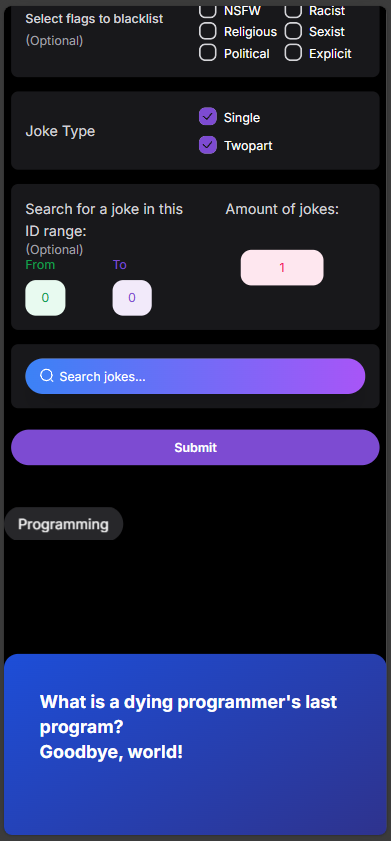
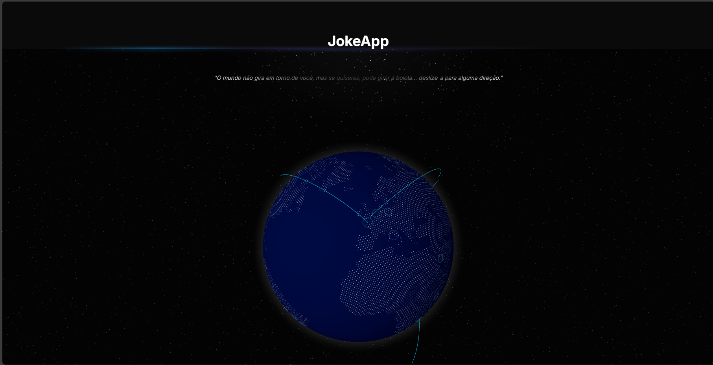
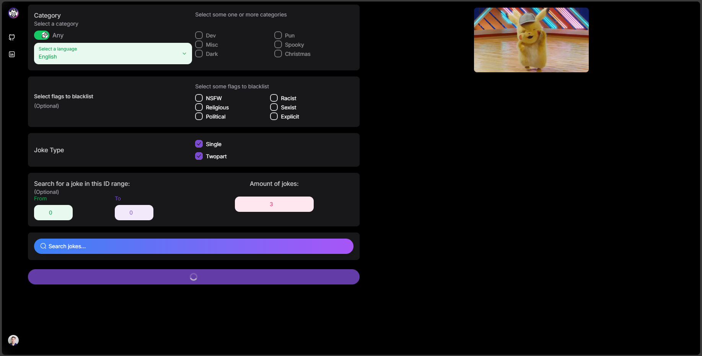

# JokeApp

### Visão geral

O JokeApp é um projeto desenvolvido com o intuito de praticar e explorar algumas
das principais tecnologias modernas de desenvolvimento web. Ele combina o poder
de um backend em NestJS com uma API GraphQL, junto com uma interface de usuário
desenvolvida em Next.js junto às bibliotecas de componentes como
[NextUI](https://nextui.org/) e [AceternityUI](https://ui.aceternity.com/).

##### Tecnologias Utilizadas

- 
- 
- 
- 
- [AceternityUI](https://ui.aceternity.com/)
- 

##### Objetivo do projeto

O principal objetivo deste projeto é explorar as vantagens da utilização de uma
API GraphQL no backend, em contraste com APIs REST tradicionais. Diferente do
REST, que pode sofrer de underfetching (dados insuficientes) ou overfetching
(dados em excesso), o GraphQL permite que o front-end solicite exatamente os
dados necessários, sem a necessidade de criar múltiplos endpoints para
diferentes conjuntos de dados.

Neste projeto, foi utilizada uma
[API pública de piadas](https://v2.jokeapi.dev/) (https://v2.jokeapi.dev/)
JokeAPI para exemplificar o consumo de dados via GraphQL. A autenticação é
necessária para acessar os recursos da API, oferecendo segurança e controle de
acesso.

##### Funcionalidades Principais

- Autenticação: Implementação de autenticação para acesso à API GraphQL.
- Consumo de API: Uso da JokeAPI para exibir piadas de forma dinâmica na
  aplicação.
- Interface Dinâmica: Construção de uma interface responsiva e moderna
  utilizando NextUI e AceternityUI.
- Exploração de GraphQL: Consumo de dados com GraphQL, permitindo controle
  granular sobre as informações retornadas ao front-end.

###### Imagens do Projeto:

| Joke                               | App                                                              | Images                                          |
| ---------------------------------- | ---------------------------------------------------------------- | ----------------------------------------------- |
|  |  |  |
|  |  |  |
|  |  |  |

### Stack

- 
- 
- 
- 
- 
- 
- 
- 
- [AceternityUI](https://ui.aceternity.com/)
